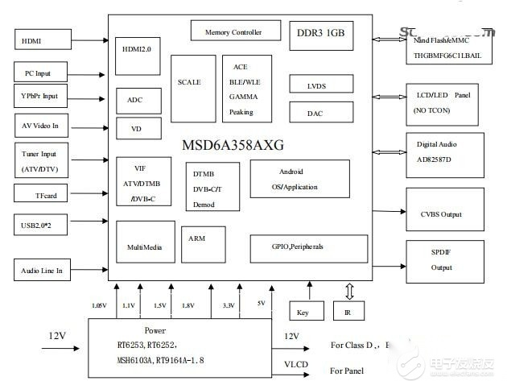

# Mainz

This seems to be a tv soc family and the kernel seem to refer it as mainz

## msd6a358

- Chip ID: 0xCA
- Bootrom : [Here](bootrom.bin)
- 4x 1.5GHz Cortex-A35
- Mali-400MP2
### Variants
msd6a358at : 1GB Ram,seem to lack of PCMCIA support

msd6a358ax : 512MB Ram

# Known devices

- [Ktc msd6a358m2c1](https://wiki.postmarketos.org/wiki/KTC_msd6a358m2c1_(ktc-msd6a358m2c1))
- [Talent TH358C1](TH358C1.pdf)
- [Dangbei D1](https://baike.baidu.com/item/%E5%BD%93%E8%B4%9DD1/56867291)
- [Acer AV10A DLP](https://fccid.io/HLZAV10A/User-Manual/User-manual-4992100.pdf)
- [Ceker A2](https://web.archive.org/web/20250930233145/https://news.qq.com/rain/a/20210510A04IE100)
